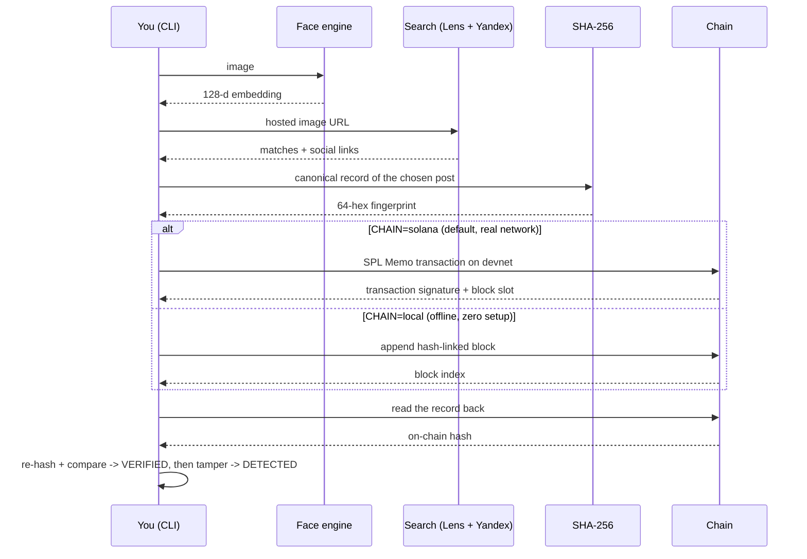

# HHGoa Task 3 — Face Identification → Reverse Image Search → Blockchain Verification

**Scan a face. Find the real posts it appears on. Anchor a tamper-proof fingerprint of that discovery on a public blockchain, then prove it back.**

[](https://explorer.solana.com/tx/2yfT3S4YfUSbBVk1ezjapM2RipL9U9gh87aJCxPZdh58vwPFioaCNia3L1Bs6UwnAYRPFNJ4QvRRs9ZeTmPux2QK?cluster=devnet)
[](#why-sha-256)
[-9945ff?style=for-the-badge)](#why-solana-and-not-anything-else)
[](#how-to-set-up-solana-for-this-project)
[](#quickstart)

---

## What this does in one breath

You give it a face. It detects the face, turns it into a 128-number biometric signature, and runs a **genuine reverse image search across Google Lens and Yandex at once**. It lists **every social platform the face was found on** (Instagram, X, Facebook, LinkedIn, TikTok, YouTube …), confirms the top hit is really the *same person* by re-encoding that image and comparing signatures, then takes a **SHA-256 fingerprint** of the discovery and writes it to a **public blockchain**. Finally it reads the fingerprint back off-chain, re-hashes, and proves the record is untouched — and shows you that even a one-character change is instantly caught.

Three steps, one command. No smart contract to deploy. No private key to hand over.

---

## Watch the demo

> Screen recording of the full CLI run (Step 1 search → Step 2 blockchain → Step 3 tamper check) goes here.

---

## Architecture

A single, simple path from a face to a verifiable on-chain proof:

```mermaid
flowchart LR
  img["Face image"] --> det["Detect + encode<br/>YuNet + SFace (128-d)"]
  det --> host["Host query image<br/>temporary public URL"]
  host --> search["Reverse image search<br/>Google Lens + Yandex"]
  search --> merge["Merge + dedupe<br/>rank by social platform"]
  merge --> conf["Confirm identity<br/>cosine similarity >= 0.363"]
  conf --> rec["Canonical record<br/>title | link | source | image"]
  rec --> hash["SHA-256 fingerprint<br/>64 hex chars"]
  hash --> chain["Write to chain<br/>Solana SPL Memo"]
  chain --> verify["Re-read + re-hash<br/>VERIFIED / TAMPER"]
```



The blockchain step runs one of two backends — a real public network by default, or a fully offline chain for a no-internet demo:



---

## What is "reverse image search + on-chain verification"?

**Reverse image search** means: instead of searching *text*, you hand a search engine a *picture* and it finds other places that same picture (or a very similar one) appears on the web. Give it a face and it surfaces the profiles and posts that face lives on.

**On-chain verification** means: you take a short, unique fingerprint of what you found and write it to a blockchain — a public ledger that nobody can quietly edit after the fact. Later, anyone can recompute the fingerprint from the data and check it against the chain. If they match, the data is exactly what was recorded. If they don't, someone tampered with it. The chain is the neutral witness.

---

## Quickstart

### 1. Clone the project

```bash
git clone https://github.com/Swagat-CREATOR/hhgoa-task3.git
cd hhgoa-task3
```

### 2. Install

```bash
python -m venv .venv
.venv/Scripts/python -m pip install -r requirements.txt
cp .env.example .env
```

### 3. Add a search key (recommended)

Reverse image search is far more reliable — and far richer in social-media hits — with a free SerpAPI key from [serpapi.com](https://serpapi.com). Put it in `.env`:

```bash
SERPAPI_KEY=your_key_here
```

No key? It still runs on the keyless Yandex path (best-effort).

### 4. Run the CLI

```bash
.venv/Scripts/python cli.py
```

Want a demo with **zero network and zero funding**? Force the offline chain:

```bash
CHAIN=local .venv/Scripts/python cli.py
```

---

## How to run it in the CLI

Launch `cli.py` and you get:

```
================================================================
             WELCOME TO HHGOA TASK3
================================================================
Face Identification -> Web/Social Search -> Blockchain Verification
```

It then asks for an image. Give it a full path, or just a filename — it also looks inside `faces/` and your Downloads folder. Press Enter and the three steps run in order:

**Step 1 — `REVERSE IMAGE SEARCH IN PROGRESS`**
Detects the face, builds the embedding, searches both engines, and prints **every social platform the face was found on** with links, the total match count, the face-match verdict (`SAME PERSON` / `uncertain`), and the single link it chose to anchor on-chain.

**Step 2 — `BLOCKCHAIN SAVING IN PROCESS`**
Builds the canonical record, hashes it, writes it to the chain, then reads it straight back. Prints the backend, program address, wallet, **transaction id**, **block/slot**, the **on-chain hash**, the recomputed hash, whether the on-chain hash is `TRUE`, and the Explorer link — ending in `RESULT: VERIFIED`.

**Step 3 — `TAMPER CHECK`**
Re-reads the on-chain record, alters the local copy the way an attacker would, re-hashes, and shows the hashes no longer match — `RESULT: TAMPER DETECTED`. This is the proof that the anchor is meaningful.

### Prefer to run the stages by hand?

```bash
.venv/Scripts/python pipeline.py faces/sample.jpg      # all four stages, non-interactive
.venv/Scripts/python face_encode.py faces/sample.jpg   # detection + 128-d encoding
.venv/Scripts/python search_post.py faces/sample.jpg   # reverse image search only
.venv/Scripts/python upload_hash.py                    # hash the found post + write to chain
.venv/Scripts/python verify_hash.py                    # re-read + verify
.venv/Scripts/python verify_hash.py --tamper           # prove tamper detection
```

---

## Why SHA-256

We fingerprint the discovery with **SHA-256**, and we do it over a *canonical* record — a JSON blob of the chosen post's `title | link | source | image` with **sorted keys** — before hashing. That choice is deliberate on every axis:

- **Deterministic and canonical.** Sorting the keys means the *same* discovery always produces the *same* 64-character hash, regardless of dict ordering or whitespace. Verification a week later reproduces the anchor bit-for-bit.
- **Fixed, tiny footprint.** Any input — a short caption or a giant record — collapses to 256 bits (64 hex chars). That fits inside a single Solana memo and costs a rounding error to store. You never pay to put big data on a chain.
- **Collision- and preimage-resistant.** SHA-256 has no practical collision or preimage attack. You cannot craft a *different* post that hashes to the same value, so the anchor genuinely binds to *this* discovery.
- **The avalanche effect = tamper detection for free.** Flip a single character in the record and roughly half the output bits flip. There is no "small, quiet edit" — Step 3 exploits exactly this.
- **It's the industry default.** Git commits, TLS certificates, and Bitcoin all lean on SHA-256. Any judge can recompute it in one line of Python, or in a browser dev console, with zero trust in us.
- **Privacy by construction.** We publish only the hash, never the underlying personal data. A commitment proves "we found this and it is unchanged" without exposing *what* it is to the whole world.

---

## Why Solana, and not anything else

We anchor the fingerprint on **Solana devnet** using the **SPL Memo program** (`MemoSq4gqABAXKb96qnH8TysNcWxMyWCqXgDLGmfcHr`) — a first-party, audited, permissionless program that writes an arbitrary string into a transaction. The transaction signature *is* the receipt. Here is the reasoning against the obvious alternatives:

| Chain / approach | Cost to write a hash | Setup burden | Public, one-click verify? | Verdict |
|---|---|---|---|---|
| **Solana devnet + SPL Memo** | ~0.000005 SOL (sub-cent even on mainnet) | Ephemeral wallet, free airdrop, **no contract** | Yes — open the signature on Explorer, read the memo | **Chosen** |
| Ethereum L1 (calldata / storage) | Real ETH, gas-volatile; storing 32 bytes is dollars | Fund a wallet with real/testnet ETH | Partly — need to decode calldata | Expensive, heavy |
| Ethereum via a **smart contract** | Gas + one-time deploy | **Deploy + audit ~200 lines of Solidity, publish ABI + address** | Only if the verifier trusts your contract and has the ABI | Extra trust surface |
| Bitcoin `OP_RETURN` | Fee-volatile, ~10-min blocks | Wallet + UTXO management | Yes, but slow and 80-byte cap | Slow, clunky |
| Polygon / other EVM L2 | Cheap, but still a contract | Still deploy + ABI | Same contract-trust caveat | No real advantage here |
| Private / permissioned chain | "Free" | Run your own node | **No** — nobody outside can independently check | Defeats the purpose |

The short version: Solana's SPL Memo gives us the **cheapest**, **fastest**, and **most publicly auditable** anchor with **no contract to deploy**. Sub-second confirmation, free devnet SOL, and a receipt a judge can open in a browser.

### Why this beats the "deploy an Ethereum contract" approach

A common Task-3 pattern is to deploy a custom Solidity contract on a testnet like Sepolia and store hashes in it. It works, but it stacks up friction and trust that we simply don't need:

- **No contract means no contract bugs.** Their proof depends on ~200 lines of Solidity being correct and un-exploitable. The SPL Memo program is Solana core infrastructure — the *same* audited address for everyone on Earth. There is nothing of ours for a judge to audit or distrust.
- **Verification needs zero artifacts.** To check an Ethereum contract you need the contract address *and* the ABI *and* the right method to decode the logs. To check ours, you paste the transaction signature into Solana Explorer and read the memo string with your eyes. Re-hash, compare, done.
- **No private key changes hands.** We never ask the judge for a private key or a pre-deployed contract address. On first run the tool generates an ephemeral wallet locally, auto-requests a devnet airdrop, and writes. The judge just runs `cli.py`.
- **Cheaper and faster.** A memo is a fraction of a Solana transaction; Ethereum storage is priced in real gas. Solana confirms in well under a second.

We kept the ceremony out so the *proof* is the star.

---

## How to set up Solana for this project

There is almost nothing to set up — that's the point — but here's exactly what happens and how to help it along.

1. **Wallet.** On first run, a keypair is generated at `wallet.json` and reused every time after. It's gitignored and never leaves your machine.
2. **Funding.** The tool auto-requests a devnet airdrop. The public faucet is heavily rate-limited per IP, so if the automatic airdrop is throttled, fund the printed wallet address once at [faucet.solana.com](https://faucet.solana.com) and re-run. Each memo transaction costs about **0.000005 SOL**, so a single airdrop lasts thousands of runs.
3. **Network (optional overrides).** Defaults are devnet. You can point elsewhere with env vars:
   ```bash
   SOLANA_RPC=https://api.devnet.solana.com
   SOLANA_CLUSTER=devnet
   ```
4. **No internet? No funding?** Set `CHAIN=local` and the identical hash → write → re-verify → tamper-detect flow runs against an offline, append-only, **hash-linked** ledger at `out/localchain.json`, where every block commits to the previous block's hash. Same guarantees, zero dependencies.

### Live proof (real Solana devnet transactions)

Two real memo transactions anchoring the SHA-256 of a discovered Instagram post:

- [`2yfT3S4YfUSbBVk1ezjapM2RipL9U9gh87aJCxPZdh58vwPFioaCNia3L1Bs6UwnAYRPFNJ4QvRRs9ZeTmPux2QK`](https://explorer.solana.com/tx/2yfT3S4YfUSbBVk1ezjapM2RipL9U9gh87aJCxPZdh58vwPFioaCNia3L1Bs6UwnAYRPFNJ4QvRRs9ZeTmPux2QK?cluster=devnet)
- [`3qsyo8eKUiGKMJ1MU2bwHpHPi8bcVxoYp9Lt7Eu7hdSGnqU1HCsY54z3njk8ZGcMtHoQzom6pnMSPTTNDqZEAgQd`](https://explorer.solana.com/tx/3qsyo8eKUiGKMJ1MU2bwHpHPi8bcVxoYp9Lt7Eu7hdSGnqU1HCsY54z3njk8ZGcMtHoQzom6pnMSPTTNDqZEAgQd?cluster=devnet)

Open either on Solana Explorer to read the on-chain memo hash for yourself. `verify_hash.py` reads it back and re-hashes to `VERIFIED`; `--tamper` flips it to `MISMATCH`.

---

## Privacy — what we deliberately did *not* do

Biometrics and a permanent public ledger are a dangerous mix if you're careless. We weren't:

- **We never put the face, the embedding, or the person's identity on-chain.** Only a SHA-256 commitment goes public. A blockchain is forever and world-readable — publishing someone's biometric vector or a bundle of their social links there would be a permanent privacy violation. The hash proves integrity while revealing nothing about *who* it is.
- **We don't build a biometric database.** The 128-d embedding lives only for the duration of a run. There is no persistent index of faces, no "search this person again later" store.
- **Each run is one-shot.** No profiles are accumulated, no history of who was searched is kept beyond the single output record.
- **No private key is ever requested.** The wallet is generated locally and ephemerally; nothing about the judge's or user's own accounts is touched.
- **Honest caveat:** to let a search engine fetch the query image, it is briefly uploaded to a temporary public image host, then not retained by us. That host is a third party and holds the image transiently — the one privacy trade-off we can't fully avoid without running our own crawler.

---

## What we are *not* claiming (limitations)

- **Not a tool to identify arbitrary private people.** Reverse image search only finds faces with an existing public web presence. An unknown, un-posted face will legitimately return no match — and that's correct behavior, not a bug.
- **Not forensic-grade biometrics.** We treat SFace cosine similarity ≥ **0.363** as "same person" (OpenCV's recommended threshold). Rough poses, heavy lighting, or low resolution can push a true match just under it.
- **Keyless search is best-effort.** The Yandex fallback can return nothing when results are JavaScript-rendered or a CAPTCHA appears. A `SERPAPI_KEY` makes search dependable and social-media-rich.
- **Devnet is a test cluster.** The transactions are genuinely real and publicly viewable, but devnet is not mainnet; over long horizons its history can be pruned. For a permanent anchor you'd point the same code at mainnet-beta (and pay a sub-cent fee).
- **The temp image host is external.** See the privacy caveat above.

---

## File map

| File | Role |
|------|------|
| `cli.py` | Interactive CLI: welcome → image → **Step 1** search → **Step 2** blockchain → **Step 3** tamper check |
| `pipeline.py` | Orchestrates all four stages end to end (non-interactive) |
| `face_encode.py` | YuNet face detection + SFace 128-d encoding |
| `search_post.py` | Reverse image search across SerpAPI Google Lens + keyless Yandex, merged and ranked by social platform |
| `chain.py` | Blockchain layer: Solana devnet SPL Memo **and** the offline hash-linked local chain |
| `upload_hash.py` | Builds the canonical record, SHA-256s it, writes it to chain |
| `verify_hash.py` | Re-reads the on-chain record and verifies / demonstrates tamper detection |
| `hashing_script.py` | Minimal standalone SHA-256 example |

---

## Thank you 💛

A genuine thank-you to the **HHGoa** team for setting this task. It's a rare hackathon brief that pushes you across three worlds at once — computer vision, real-world web search, and blockchain — and makes them meet in something you can actually run and verify end to end. We learned a lot building it, and we had fun doing it.

**#HHGoa2026 · #RAGInGoa · Task 3 — Face Identification & Blockchain Verification**
